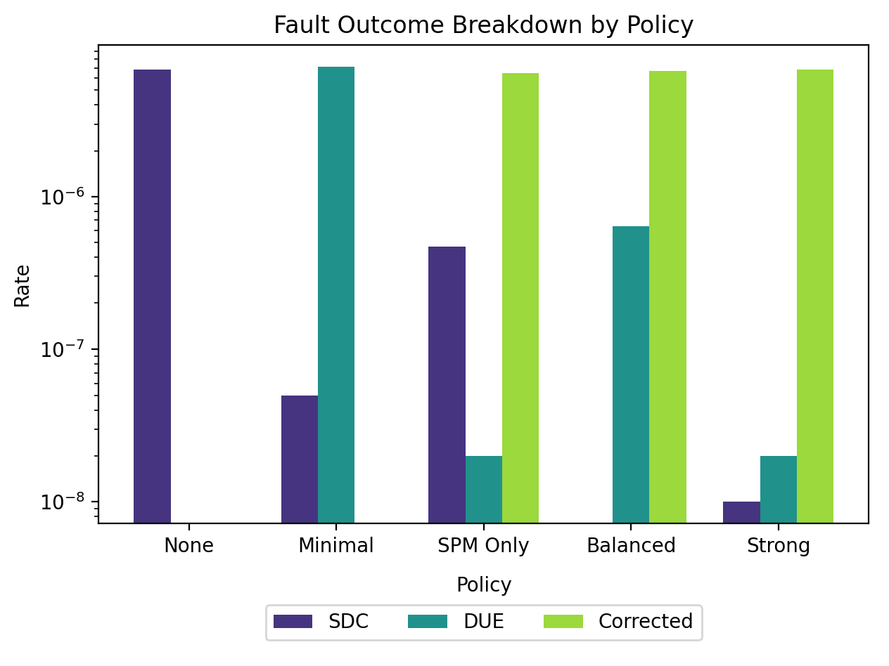
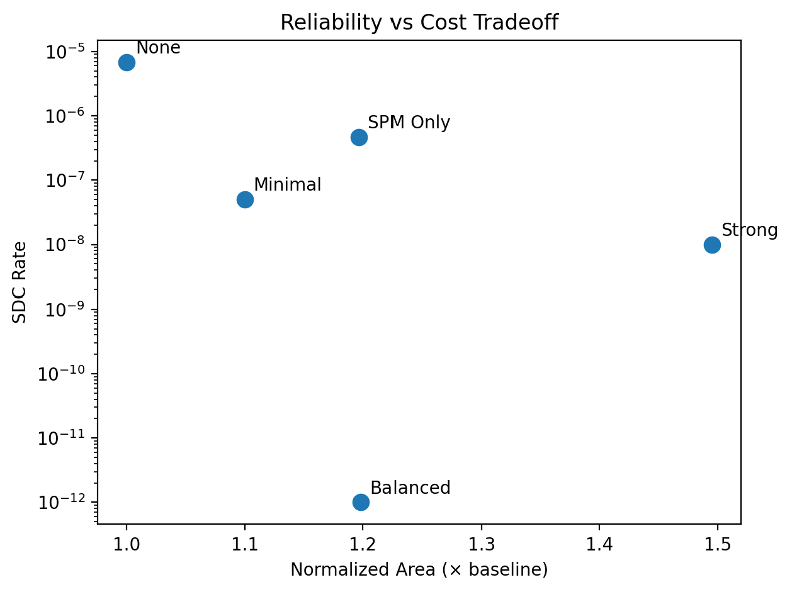

# PIM Reliability Framework (State Protection + ECC Modeling)

This project models reliability in (PIM) architectures, focusing specifically on **stateful components (register files, scratchpads, caches)** and how different protection schemes affect system reliability.

It extends prior ECC modeling work in PIMeval by introducing a configurable framework for evaluating **internal state protection + memory interface protection**.

---

## Project Goal

The goal of this project is to:

- Model soft errors in PIM **stateful storage components**
- Evaluate different protection strategies (Parity, SECDED, Strong ECC)
- Measure tradeoffs between:
  - Silent Data Corruption (SDC)
  - Detected Uncorrectable Errors (DUE)
  - Area / latency overhead

We intentionally **do not model compute-unit faults**, focusing instead on state reliability.

---

## Project Structure
```
model/           
├── state_component.py   # Defines RF / SPM / Cache abstractions
├── pim_unit.py          # Groups components into a PIM unit

protection/      
├── schemes.py           # ECC / parity / protection definitions
├── policy.py            # Maps protection schemes to components

analysis/        
├── error_model.py       # Base + effective error rate modeling
├── metrics.py           # System-level SDC / DUE computation
├── simulation.py       # Monte Carlo fault injection model
├── cost_model.py       # Area + latency overhead modeling

plots/           
├── plot_results.py     # Generates evaluation figures

config.py               # Predefined PIM systems and policies
main.py                 # Entry point for running experiments
```


---

## How the Model Works

### 1. PIM Abstraction
Each PIM unit is modeled as a collection of:

- Register File (RF)
- Scratchpad Memory (SPM)
- Cache (optional)

Each component has:
- Size (bits)
- Access rate
- Soft error rate (FIT-based abstraction)

---

### 2. Protection Schemes
Each component can be assigned a protection scheme:

- None (no protection)
- Parity (error detection only)
- SECDED ECC (single-error correction)
- Strong ECC (high correction capability)

---

### 3. Fault Modeling

The system evaluates reliability using three complementary approaches: analytical modeling, Monte Carlo simulation, and fixed error injection for validation.

---

#### A. Analytical Model
- Computes expected reliability metrics from component error rates and protection policies
- Based on FIT-derived error probabilities and scheme parameters
- Outputs:
  - Corrected rate  
  - DUE (Detected Uncorrectable Error) rate  
  - SDC (Silent Data Corruption) rate  

Provides a theoretical baseline for comparison.

---

#### B. Monte Carlo Simulation
- Simulates fault behavior using randomized trials
- Errors occur based on an effective per-component probability
- Each error is classified as:
  - Corrected
  - DUE
  - SDC
- Aggregated across components and trials to estimate empirical rates

Used to validate analytical results under stochastic conditions.

---

#### C. Fixed Error Injection (Sanity Check)
- Injects a fixed number of errors directly into the classification logic
- Does not model error occurrence probability
- Used to verify:
  - Correctness of classification logic
  - Correct probability partitioning in protection schemes
  - Expected behavior of policies independent of rare-event sampling

---

### 4. Cost Model
Each protection scheme introduces:
- Area overhead
- Latency penalty

This enables tradeoff analysis between:
- Reliability improvement
- Hardware cost

---

## Example plot 
For simple pim device with 128B register file, 8192B scratchpad \
<br>


<br>

